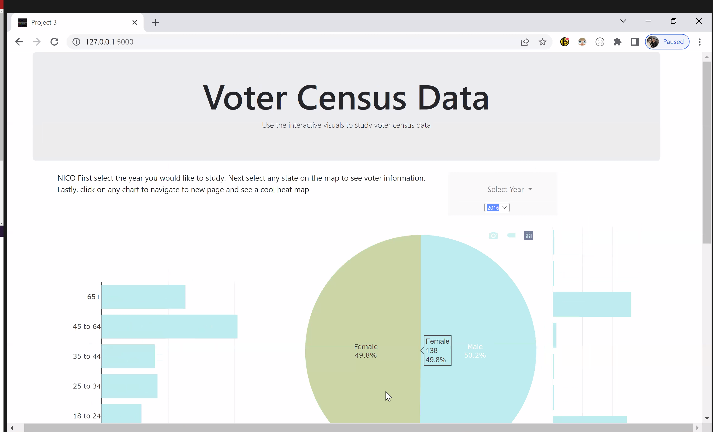

# Project 3
**_Created by [David Mostacero](https://github.com/dave1407), [Madduri Sridevi](https://github.com/SrideviMadduri), [Nicoleta Cosereanu](),  [Jordon Moses](https://github.com/jm18443), & [Anger Gardy]()._**

An interactive website that looks ove voting data of 1016 and 2018 that helps to show us more about how voting will be in the future..<br><br>




## Background
We researched datasets that would help us track voting trends among ethnicity, sex, and age. We found data that tracked the voting habits of voters in the years of 2016 and 2018. 2016 being the year of the presidential election and 2018 being the year of senate and house of representative elections.

## Getting Started
_If you prefer to run the dashboard on your local server, please follow the instructions below. Otherwise, you can view the deployed page [here](http://apizzo1-hindsight-2020.herokuapp.com/)._

1. Download the repo in your preferred manner.
2. Create a file called `config.py` in the `/project` folder. 
<br> This file should contain username , password and port for postgress database.
3. Create database Vote_data_db in  PostgreSQL database.
4. Open  project3_Voting_Data.ipynb file in  jupyter notebook and run the file.
5. Run `app.py` in your terminal by using the following command:
```
$ python app.py
```

## Resources, Libraries, & Tools

**Data sources:**
* [Voting and registration data](https://data.world/uscensusbureau/voting-and-registration-data) for national & state data on voting trends

**Libraries:**
* [Leaflet](https://leafletjs.com/index.html), [Leaflet PointInPolygon](https://github.com/hayeswise/Leaflet.PointInPolygon), [Leaflet Heat Map](https://github.com/Leaflet/Leaflet.heat), [Leaflet US Choropleth](https://leafletjs.com/examples/choropleth/us-states.js), [Mapbox](https://docs.mapbox.com/api/maps/#styles) for mapping
* [Plotly for JavaScript](https://plotly.com/javascript/)
* [Bootstrap](https://getbootstrap.com/) for website grid system

**Tools & languages:** JavaScript, HTML, CSS, Python Flask, Jupyter Notebook, PostgreSQL, Bootstrap

## Features
After running the Flask application, begin exploring the data by perusing the data by years using the drop down in the top right corner..

The map, barchart, piechart, and cards will reflect that change and show the data based on the year.

**Interactive Map** The map is interactive and will change based on where the mouse is hovering and by clicking on the states the data in the pie chart and bar charts will change.

**Bar Chart** can be viewed and toggled on the interactive map. State borders are also visible and hoverable. If a state is clicked, the bar chart will populate with that states data. By clicking the years bar chart the website will be navigated to a heat map that shows the density of voters by age using the selected drop down year. By clicking the ethnicity bar chart the website will be navigated to a heat map that shows the density of voters by ethnicity using the selected drop down year. 

**Pie Chart** can be viewed and toggled on the interactive map. State borders are also visible and hoverable. If a state is clicked, the bar chart will populate with that states data.  By clicking the pie chart the website will be navigated to a heat map that shows the density of voters by sex using the selected drop down year. 


## Analyses & Discussion
As a whole, our dashboard is equipped for you to draw numerous observations about interrelations among each of our featured sections. Given the vast amount of available trends, it is impractical to analyze every significant pattern. As such, we've only listed a handful of noteworthy examples of interrelations that we observed, but we encourage you all to go through the timeline and explore the data yourselves.

**Select analyses:**

*

## Future Considerations
Some tasks we'd like to build on in future commits:

*  
